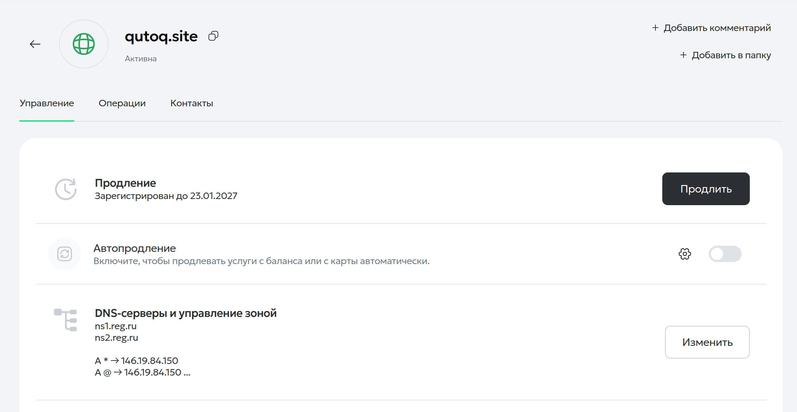
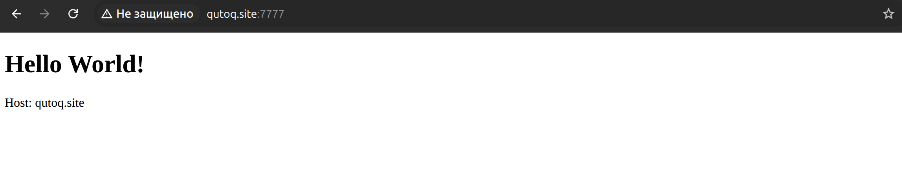
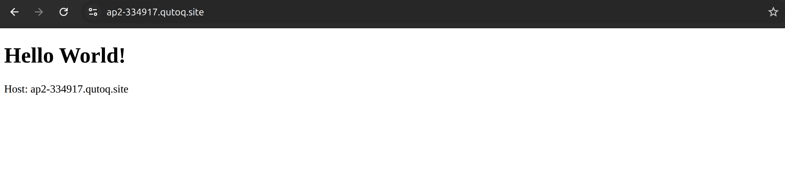
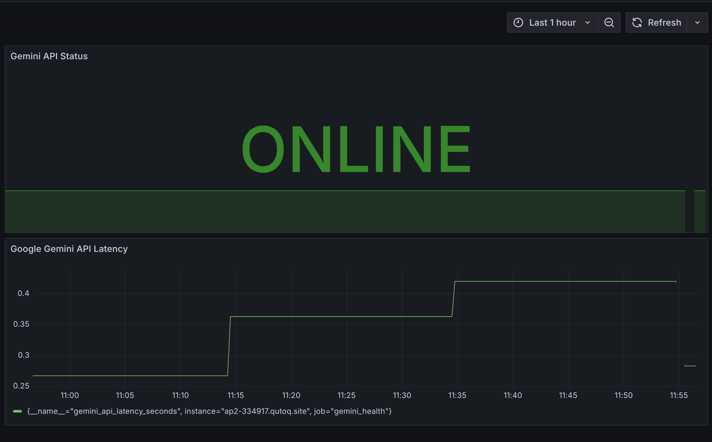
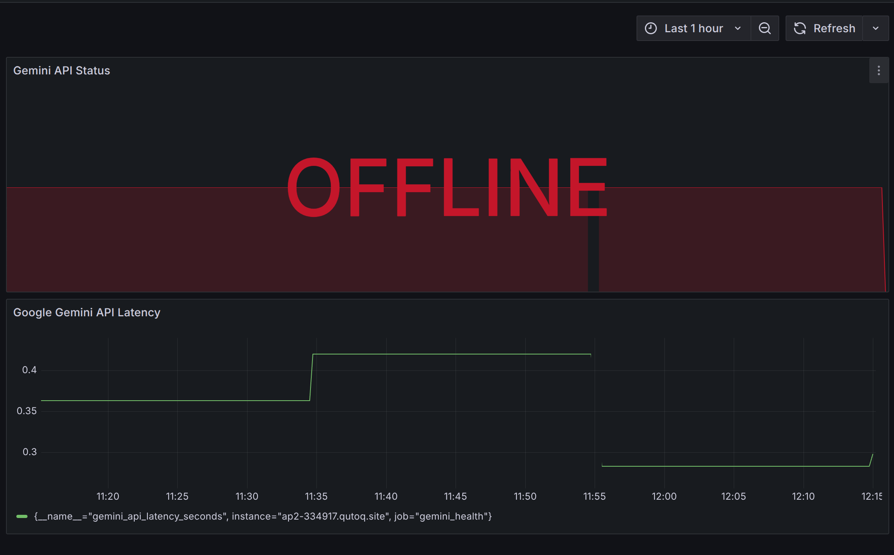
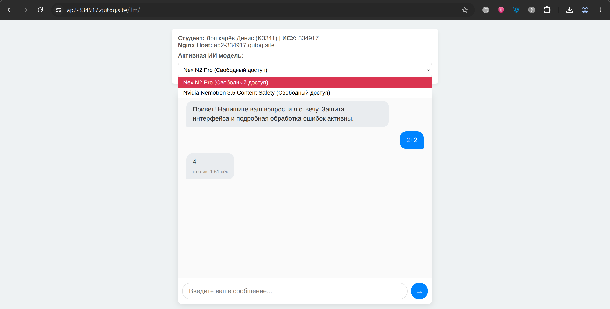

# Отчет по лабораторной работе
## «Администрирование платформ на ОС Linux»

* **Предмет:** Администрирование платформ на ОС Linux
* **Группа:** АП 2.4
* **Студент:** Лошкарёв Денис (K3341)
* **ИСУ:** 334917
* **Домен:** [ap2-334917.qutoq.site](https://ap2-334917.qutoq.site)
* **Демо** [ap2-334917.qutoq.site/llm](https://ap2-334917.qutoq.site/llm)

---

## Введение и выбор инфраструктуры

Вместо того чтобы разворачивать стандартную локальную виртуалку в закрытом контуре (что накладывает кучу ограничений при работе с внешними API), я решил использовать собственную готовую инфраструктуру:
1. Удаленный VPS-сервер со статическим IP-адресом.
2. Собственный домен `qutoq.site`, зарегистрированный на Reg.ru.

Для выполнения лабораторной работы я выделил поддомен под свой номер ИСУ: **`ap2-334917.qutoq.site`**. 

Такой подход позволил мне настроить полноценный веб-сервер, который виден из интернета, и использовать автоматические методы верификации SSL без лишней рутины.

---

## Задание 1

### Шаг 1. Сетевая настройка и базовая безопасность

Первым делом я зашел в личный кабинет Reg.ru. Чтобы не создавать отдельные записи вручную под каждую задачу, я настроил wildcard-запись вида *.qutoq.site, направив её на статический IP-адрес моего VPS. Благодаря этому правилу абсолютно любой поддомен (включая нужный мне для работы ap2-334917.qutoq.site) автоматически перенаправляется на мой сервер.



Для базовой защиты сервера я установил стандартный набор утилит: SSH-сервер для удаленного управления и `fail2ban` для автоматической блокировки ботов, пытающихся подобрать пароли:

```bash
sudo apt update
sudo apt install openssh-server fail2ban -y
sudo systemctl enable --now ssh fail2ban
```

---

### Шаг 2. Настройка HTTP веб-сайта на альтернативном порту 7777

Для сайта я создал отдельный каталог в стандартном месте `/var/www/` и сделал своего пользователя владельцем папки, чтобы спокойно редактировать файлы без бесконечных `sudo`:

```bash
sudo mkdir -p /var/www/ap2-334917.qutoq.site
sudo chown -R $USER:$USER /var/www/ap2-334917.qutoq.site
```

В качестве стартовой страницы я написал максимально простой HTML-файл. Чтобы выполнить требование лабы по отображению имени виртуального хоста из переменной Nginx, я задействовал технологию **SSI (Server Side Includes)**:

`index.html`:
```html
<!DOCTYPE html>
<html>
<head>
    <meta charset="UTF-8">
    <title>Hello World</title>
</head>
<body>
    <h1>Hello World!</h1>
    <p>Host: <!--# echo var="host" --></p>
</body>
</html>
```

Далее я создал файл конфигурации виртуального хоста Nginx: `/etc/nginx/sites-available/ap2-334917.qutoq.site`. Я настроил его на работу на порту `7777`, включил директиву `ssi on;` для парсинга переменной хоста и прописал кастомные пути для логов.

После создания символической ссылки в `sites-enabled` и перезапуска Nginx, сайт стал успешно открываться по HTTP.

**Результат работы сайта по HTTP (порт 7777):**


---

### Шаг 3. Получение SSL-сертификата Let's Encrypt и настройка HTTPS

Поскольку у моего сервера есть белый IP-адрес и открыт порт , я решил пойти самым надежным и быстрым путем — использовать стандартный **HTTP-01 челлендж** через официальный плагин Nginx для Certbot. Это избавило меня от ручной настройки TXT-записей в DNS и ожидания их обновления.

Я установил Certbot и запустил автоматический выпуск:
```bash
sudo apt install certbot python3-certbot-nginx -y
sudo certbot --nginx -d ap2-334917.qutoq.site
```

Certbot сам прошел все проверки, скачал сертификаты и автоматически интегрировал их в конфигурационный файл Nginx.

После этого я зашел в конфигурационный файл и привел его к красивой, профессиональной структуре, разделив её на три блока:
1. **Порт 7777:** Обычный HTTP (оставил для отчета).
2. **Порт 80:** Стандартный HTTP, который перенаправляет (301 redirect) всех пользователей на безопасный HTTPS.
3. **Порт 443:** Защищенный HTTPS со всеми SSL-сертификатами.

**Итоговый конфигурационный файл Nginx:**
```nginx
server {
    listen 7777;
    server_name ap2-334917.qutoq.site;
    root /var/www/ap2-334917.qutoq.site;
    index index.html;
    ssi on;
    access_log /var/log/nginx/ap2-334917.qutoq.site_access.log;
    error_log /var/log/nginx/ap2-334917.qutoq.site_error.log;

    location / {
        try_files $uri $uri/ =404;
    }
}

server {
    listen 80;
    server_name ap2-334917.qutoq.site;
    return 301 https://$host$request_uri;
}

server {
    listen 443 ssl;
    server_name ap2-334917.qutoq.site;
    root /var/www/ap2-334917.qutoq.site;
    index index.html;
    ssi on;
    access_log /var/log/nginx/ap2-334917.qutoq.site_access.log;
    error_log /var/log/nginx/ap2-334917.qutoq.site_error.log;

    location / {
        try_files $uri $uri/ =404;
    }

    ssl_certificate /etc/letsencrypt/live/ap2-334917.qutoq.site/fullchain.pem;
    ssl_certificate_key /etc/letsencrypt/live/ap2-334917.qutoq.site/privkey.pem;
    include /etc/letsencrypt/options-ssl-nginx.conf;
    ssl_dhparam /etc/letsencrypt/ssl-dhparams.pem;
}
```

Чтобы закрыть возможные бреши в безопасности, я открыл стандартные порты `80` и `443` в брандмауэре `ufw`, а порт `7777` (после успешного снятия скриншота для отчета) удалил из разрешенных правил извне:

```bash
sudo ufw allow 80/tcp
sudo ufw allow 443/tcp
sudo ufw delete allow 7777/tcp
```

**Результат работы сайта по HTTPS (порт 443):**


---

## Задание 2

Во второй части лабораторной работы моей задачей было настроить автоматическую систему мониторинга работоспособности ИИ, сконфигурировать защищенное проксирование в Nginx и развернуть веб-страницу интерактивного чат-бота.

---

### Шаг 1. Безопасность и хранение секретных ключей

Согласно требованиям безопасности, все секретные ключи авторизации должны быть скрыты от посторонних глаз. Я создал специальную директорию на сервере и разместил ключи в изолированных файлах, ограничив права доступа только для суперпользователя `root` (права `600`):

```bash
sudo mkdir -p /etc/secrets
# Сохраняем ключи Google Gemini и OpenRouter
sudo chmod 600 /etc/secrets/gemini.key
sudo chmod 600 /etc/secrets/openrouter.key
sudo chown root:root /etc/secrets/*.key
```

При попытке просмотреть эти файлы от лица обычного пользователя система выдает ошибку `Permission denied`, что гарантирует безопасность наших учетных данных.

---

### Шаг 2. Автоматизация мониторинга (Systemd + Bash-скрипт)

Изначально вся фоновая система мониторинга проектировалась и настраивалась под **Google Gemini API**. Чтобы автоматизировать процесс контроля «здоровья» API, я написал скрипт, который раз в 20 минут опрашивает Google, замеряет время отклика и формирует файл метрик для Prometheus.

#### 2.1. Скрипт сбора метрик
Файл `/usr/local/bin/api-check-334917.sh` (права доступа `700`):
```bash
#!/bin/bash
METRICS_FILE="/var/www/ap2-334917.qutoq.site/metrics.txt"
API_URL="https://generativelanguage.googleapis.com/v1beta/models"

START_TIME=$(date +%s.%N)
RESPONSE=$(curl -s -w "\n%{http_code}" -X GET "${API_URL}?key=${GEMINI_API_KEY}")
HTTP_CODE=$(echo "$RESPONSE" | tail -n 1)
END_TIME=$(date +%s.%N)

LATENCY=$(awk -v start="$START_TIME" -v end="$END_TIME" 'BEGIN {printf "%.3f", end - start}')

if [ "$HTTP_CODE" -eq 200 ]; then
    STATUS_VAL=1
else
    STATUS_VAL=0
fi

cat << EOF > "$METRICS_FILE"
# HELP gemini_api_latency_seconds Время отклика API Google Gemini в секундах
# TYPE gemini_api_latency_seconds gauge
gemini_api_latency_seconds $LATENCY

# HELP gemini_api_status_success Статус работоспособности API (1 - успех, 0 - ошибка)
# TYPE gemini_api_status_success gauge
gemini_api_status_success $STATUS_VAL
EOF

echo "Prometheus metrics updated: Status=${STATUS_VAL}, Latency=${LATENCY}s"
```

#### 2.2. Настройка службы и таймера Systemd
Для регулярного запуска скрипта я создал системную службу и таймер в каталоге `/etc/systemd/system/`.

Для дополнительных баллов за ужесточение безопасности (Hardening) в файл службы были добавлены опции изоляции процесса в песочнице (`PrivateTmp`, `ProtectSystem`, `ProtectHome`, `NoNewPrivileges`).

Файл службы `api-check-334917.service`:
```ini
[Unit]
Description=Google Gemini API Health Check Service (ISU 334917)
After=network-online.target
Wants=network-online.target

[Service]
Type=oneshot
EnvironmentFile=/etc/secrets/gemini.key
ExecStart=/usr/local/bin/api-check-334917.sh
User=root
Group=root

PrivateTmp=true
ProtectSystem=full
ProtectHome=true
NoNewPrivileges=true
```

Файл таймера `api-check-334917.timer` (запуск каждые 20 минут):
```ini
[Unit]
Description=Run Google Gemini API Health Check every 20 minutes

[Timer]
OnBootSec=2s
OnUnitActiveSec=20m
Unit=api-check-334917.service

[Install]
WantedBy=timers.target
```

После перезапуска демона Systemd таймер успешно встал на учет и начал стабильно запускать службу в фоновом режиме.

**Скриншот статуса работы службы в Systemd:**


---

### Шаг 3. Интеграция с Nginx, Prometheus и Grafana

Чтобы Prometheus мог забирать сгенерированные метрики, я настроил в Nginx отдачу файла `/metrics`. Из соображений безопасности я полностью закрыл этот адрес для всего внешнего интернета, разрешив доступ только локальному серверу и внутренним подсетям Docker (Prometheus определился в логах Nginx под IP-адресом `172.31.0.3`):

```nginx
    location /metrics {
        allow 127.0.0.1;
        allow 172.17.0.0/16;
        allow 172.18.0.0/16;
        allow 172.31.0.0/16;
        deny all;
        alias /var/www/ap2-334917.qutoq.site/metrics.txt;
        default_type text/plain;
    }
```

Далее я добавил задачу сбора данных в файл `prometheus.yml` моего Docker-контейнера Prometheus:
```yaml
     - job_name: 'gemini_health'
       metrics_path: '/metrics'
       scheme: https
       static_configs:
         - targets: ['ap2-334917.qutoq.site']
```

После применения настроек в Grafana заработал полноценный мониторинг.

---

### Шаг 4. Работа с лимитами и переход на OpenRouter

При тестировании выяснилось, что GET-запросы (список моделей в Systemd) проходят без проблем, и в Grafana статус доступности Gemini всегда показывался как `ONLINE`. 

Однако при попытке отправить реальный текстовый запрос на генерацию контента (POST-запрос) из интерфейса чат-бота, Google возвращал ошибку `RESOURCE_EXHAUSTED` с лимитом `0`. Скорее всего, Google блокирует и ограничивает именно генеративные API-запросы, исходящие от IP-адресов коммерческих хостингов (VPS).

#### Как было решено поступить:
Чтобы чат-бот стабильно работал для пользователей, я решил использовать гибридный подход:
1. **Мониторинг:** Оставил настроенным на Google Gemini. Наш фоновый скрипт исправно собирает данные, а Grafana строит графики. Для отчета я приложил два скриншота: статус `ONLINE` при обычной работе и статус `OFFLINE`, который я зафиксировал, когда **специально временно отключил API-ключ** для проверки отзывчивости системы мониторинга (она мгновенно отреагировала на сбой).
2. **Чат-бот (страница `/llm/`):** Был переведен на работу через ИИ-агрегатор **OpenRouter**, который стабильно принимает запросы с серверов без блокировок по IP и предоставляет бесплатный доступ к альтернативным моделям.

**Скриншот Grafana со статусом ONLINE:**


**Скриншот Grafana со статусом OFFLINE (для демонстрации работы дашборда при отключении ключа):**


---

### Шаг 5. Настройка безопасного Nginx-прокси для OpenRouter

Чтобы скрыть API-ключ OpenRouter от конечных пользователей сайта, я настроил обратное проксирование (Reverse Proxy) в Nginx. 

Сначала я сохранил ключ в формате переменной Nginx в файле `/etc/nginx/openrouter_key.conf` (права доступа `600`), а в секцию `server` на порту 443 добавил прокси-блок `/api/chat`. Nginx сам принимает запросы от нашего фронтенда, скрытно подставляет секретный заголовок авторизации `Authorization: Bearer <key>` и перенаправляет запрос на сервера OpenRouter:

```nginx
    location /api/chat {
        include /etc/nginx/openrouter_key.conf;
        proxy_pass https://openrouter.ai/api/v1/chat/completions;
        proxy_set_header Authorization "Bearer $openrouter_key";
        proxy_set_header Content-Type "application/json";
        proxy_ssl_server_name on;
        
        access_log /var/log/nginx/api_proxy.log combined;
        error_log /var/log/nginx/api_proxy_error.log;
    }
```
*все прокси-запросы к ИИ логируются в отдельный файл api_proxy.log с фиксацией времени отклика*

---

### Шаг 6. Интерактивный фронтенд чат-бота на `/llm/`

В папке `/var/www/ap2-334917.qutoq.site/llm/` я развернул стильный веб-интерфейс чат-бота. Для получения дополнительных баллов во фронтенд были встроены следующие возможности:

1. **Динамический выбор моделей:** Пользователь может прямо на лету переключаться в выпадающем списке между универсальным ИИ **Nex N2 Pro** и специализированным фильтром контента **Nvidia Nemotron 3.5**.
2. **Логирование времени ответа:** Под каждым сообщением бота выводится точное время отклика сервера в секундах, замеряемое на стороне клиента.
3. **Защита интерфейса (UI Lock)**: На время генерации ответа поле ввода и кнопка отправки блокируются, защищая API от спама кликами.
4. **Умная обработка ошибок**: Скрипт проверяет статус сети браузера (Offline Detection), безопасно парсит JSON и расшифровывает любые сетевые ошибки понятным языком в специальном красном дизайне.
5. **Авто-повторение попыток (Auto-Retry)**: Если провайдер перегружен (ошибка HTTP 429), скрипт в фоне делает до 3 попыток запроса с паузой в 2 секунды, прежде чем выдать ошибку пользователю.

**Скриншот успешной работы чат-бота и переписки с ИИ на странице `/llm/`:**

